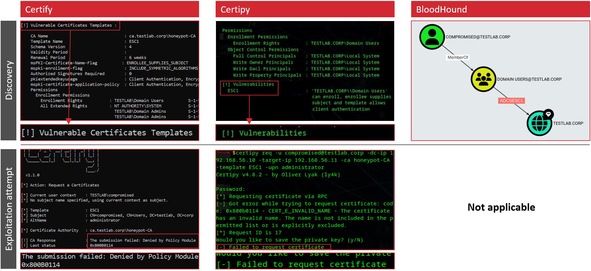
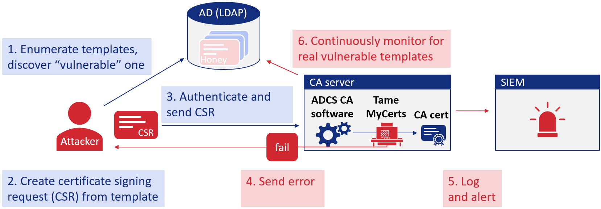
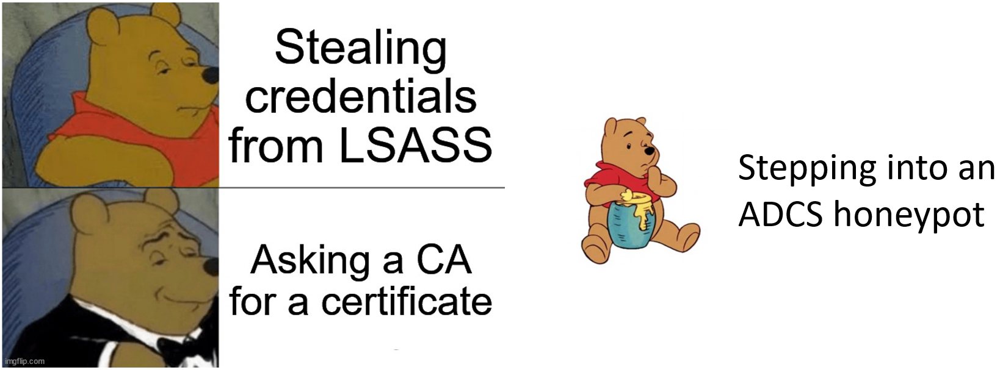

# Certiception

**Certiception is a honeypot for Active Directory Certificate Services (ADCS)**, designed to trap attackers with a realistic and attractive bait that triggers highly relevant alerts. 

Developed by the [SRLabs](https://srlabs.de) Red Team, Certiception creates a vulnerable-looking certificate template in your ADCS environment, sets up restrictions to prevent exploitation, and supports in setting up effective alerting.

Originally released at [Troopers24](https://troopers.de/troopers24/talks/8fjh87/), Certiception comes with a strategic guide to effective deception: [The Red Teamers' guide to deception](./documentation/The_Red_Teamers_Guide_To_Deception.pdf)

**tl;dr: From an attacker's perspective: Looks vulnerable, Exploitation fails.**



## Background

In our Red Team and Incident Management engagements we regularly observe that lateral movement and privilege escalation go undetected.
If detections trigger at all, they are not reacted to in a timely manner, because false positives are commonplace.
We believe internal honeypots (aka. canaries, aka. deception tech) are an effective way for defenders to catch threats that make it through initial defenses.

Internal honeypots are intentional traps for attackers placed in your network.
They look vulnerable but trigger an alert on exploitation. Here's why we think deception has great potential: 

* **Low effort and cost:** Setup can rely on existing tools such as a SIEM.
* **High relevance alerts:** A triggered honeypot hints at a significant threat, so the alerts are worth investigating.
* **Low noise:** Designed to trigger only on malicious activity, internal honeypots have a low false positive rate.

Despite their potential, we regularly encounter fundamentally ineffective deception setups.
To help defenders create more effective honeypots, Certiception comes with an extensive [deception strategy guide](./documentation/The_Red_Teamers_Guide_To_Deception.pdf).

Active Directory Certificate Services (ADCS) is an ideal location for a honeypot:

1. **Easy Access:** Accessible by all domain users, ADCS is easy for attackers to discover.
2. **High Stakes:** Vulnerabilities can lead to full domain compromise, making exploitation highly attractive.
3. **Common Knowledge:** Vulnerabilities and exploitation tools are widely known.
4. **Authenticity:** Vulnerable ADCS templates are commonplace, raising little contempt.
5. **Under-Monitored:** Many networks barely monitor ADCS, encouraging even cautious attackers to dare exploitation.

This is why we built Certiception.

## Concept

Certiception sets up a new CA in your environment and configures an [ESC1](https://posts.specterops.io/certified-pre-owned-d95910965cd2) honeypot.

It is implemented as an Ansible playbook calling multiple roles. Overall, the following steps are executed:

* Set up a new CA, add a “vulnerable” ESC1 template and enable it only on the new CA
* Install and configure the [TameMyCerts](https://github.com/Sleepw4lker/TameMyCerts) policy module to prevent issuance if certificate signing requests contain a SAN
* Enable extended audit log to include template names in event logs
* Print a SIGMA rule to set up alerting in your SIEM
* Set up continuous checks with [Certify](https://github.com/GhostPack/Certify) to catch any other CA enabling the vulnerable template

Parameters like the CA or template name can be customized to disguise the honeypot.

So this is how Certiception works::



Support for other types of ESC vulnerabilities and the capability to add honey templates to existing CAs are planned for the future.

### Alerting

Certiception uses built-in Windows events from the CA and events generated by the TameMyCerts policy module.
To get the built-in CA events with the required information, Certiception enables the extended audit log on the honey CA server.

We suggest alerting on critical and medium events:

| Event source         | Event ID                                | Alert                                                                    |
| -------------------- | --------------------------------------- | ------------------------------------------------------------------------ |
| TameMyCerts          | 6 – CSR denied due to policy violation  | **CRITICAL** - attempted exploitation via SAN |
| Windows Security Log | 4886 – Certificate enrollment requested | **MEDIUM** - Honey template was used                                     | 
| Windows Security Log | 4887 – Certificate issued               | Not used, 4886 has more coverage                                         |
| Windows Security Log | 4888 – Certificate request denied       | Not used, TameMyCerts 6 is more precise when issuance fails non-malicious|

Certiception outputs ready-to-use SIGMA rules for the two different alerts.
You only need to ensure the respective event IDs are onboarded into your SIEM and then setup alerting with the SIGMA rules.

Future releases might introduce new or additional SIGMA rules.

## Usage

Follow these steps to set up your ADCS honeypot.

#### Prerequisites

* **Domain-joined Windows server** to install the CA
* **Machine with Ansible and WinRM connectivity to server** to clone this repository and execute Certiception
* **Local admin privileges on server** to install the CA and exploitation protections
* **Enterprise Admin account** to register the new CA
* **Basic Domain account** without any privileges to execute continuous Certify checks

### Installing Certiception

1. Configure Ansible to access your CA host via `inventory.yml`
2. Customize parameters for your honeypot in `host_vars/honeypotCA.yml`
3. Create EDR exception for future Certify location (used for monitoring if any non-honey CAs enable the vulnerable template, not required yet as Certify-based monitoring it not yet published)
4. Run Certiception Ansible playbook
```bash
ansible-playbook -i inventory.yml playbooks/certiception.yml
```
4. Onboard the server's event logs to your SIEM and configure alerts with the printed SIGMA rules
5. Verify and manually test your setup

## Safety and security considerations

This tooling is provided without any warranty or guarantees.
It combines existing software, automating installation and configuration.
You are responsible for all installation and configuration steps performed by Certiception.

If you use this tool, we strongly recommend you read the source code to understand what you configure and verify your setup after installation.

Additionally, we recommend considering the following:
1. At the time of release the tool was not scrutinized by the community yet - expect safety imnprovements over time.
2. An ADCS honeypot only makes sense if the PKI team takes up the ownership for it. When performing configuration changes, the implications on the honeypot need to be considered. E.g. when migrating the honey CA to a new server without also migrating the policy module, the honey template becomes exploitable.
3. Besides the honey template, your honey CA should be secured, hardened and managed like any other ADCS CA in your network
4. The CA set up by this tool is a plain CA with the CA certificate stored on disk and no HSM
5. Certiception sets up basic checking for real vulnerable templates utilizing [Certify](https://github.com/GhostPack/Certify) on the CA server. For production environments we recommend running these continuous checks on a separate machine. Checks should not only be based on "find" commands for template identification but also attempt exploitation of the honey template (SIEM allow-listed) to catch configuration changes that make it exploitable on the honey CA.

## Future work

* Support placing honey templates on existing CAs
* Implement support for more ESC misconfigurations (e.g. ESC3 and ESC8)
* Implement additional hardening options against exploitation
* Use lower privilege accounts instead of enterprise admin
* Add less suspicious error message on denied CSRs
* Investigate and mitigate ways of fingerprinting Certiception
* Strengthen continuous monitoring intended to catch and mitigate insecure configurations 

## License

* SRLabs' Certiception is released under the [Apache-2.0 License](https://www.apache.org/licenses/LICENSE-2.0)
* Ashley McGlone's [ADCSTemplate](https://github.com/GoateePFE/ADCSTemplate) is available under the terms of the [MIT License](https://opensource.org/license/mit)
* Uwe Gradenegger's [TameMyCerts](https://github.com/Sleepw4lker/TameMyCerts) falls under the [Apache-2.0 License](https://www.apache.org/licenses/LICENSE-2.0)

## Acknowledgements

* [Uwe Gradenegger](https://github.com/Sleepw4lker) for his great [PKI and ADCS blog](https://www.gradenegger.eu/en/) and as the developer of the [TameMyCerts](https://github.com/Sleepw4lker/TameMyCerts) policy module
* [Ashley McGlone](https://twitter.com/goateepfe) for the [ADCSTemplate](https://github.com/GoateePFE/ADCSTemplate) scripts we use to create the honey template
* [@harmj0y](https://twitter.com/harmj0y) and [@tifkin_](https://twitter.com/tifkin_) for their [ADCS research](https://posts.specterops.io/certified-pre-owned-d95910965cd2) and corresponding [Certify tool](https://github.com/GhostPack/Certify)
* [@ly4k_](https://twitter.com/ly4k_) who found [ESC9 and ESC10](https://research.ifcr.dk/certipy-4-0-esc9-esc10-bloodhound-gui-new-authentication-and-request-methods-and-more-7237d88061f7) (and develops [Certipy](https://github.com/ly4k/Certipy))
* [@sploutchy](https://infosec.exchange/@sploutchy) for [ESC11](https://blog.compass-security.com/2022/11/relaying-to-ad-certificate-services-over-rpc/)
* [Hans-Joachim Knobloch](https://www.linkedin.com/in/hans-joachim-knobloch-165527267/) for [ESC12](https://pkiblog.knobloch.info/esc12-shell-access-to-adcs-ca-with-yubihsm)
* [@Jonas_B_K](https://twitter.com/jonas_b_k) and [@_wald0](https://x.com/_wald0) auditing [ADCS with Bloodhound](https://posts.specterops.io/adcs-attack-paths-in-bloodhound-part-1-799f3d3b03cf) and [ESC13](https://posts.specterops.io/adcs-esc13-abuse-technique-fda4272fbd53)
* [@PyroTek3](https://twitter.com/PyroTek3) for his [previous work](https://www.hub.trimarcsecurity.com/post/the-art-of-the-honeypot-account-making-the-unusual-look-normal) on Active Directory honeypots
* [@gentilkiwi](https://twitter.com/gentilkiwi) for inspiration like [this one](https://twitter.com/gentilkiwi/status/706515035422629890) 
* All the friends and colleagues who provided input and feedback for our talk and development

